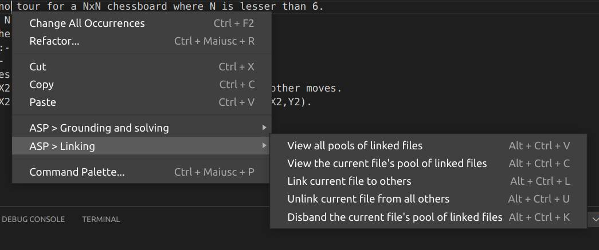

# Answer Set Programming Debugger

This extension provides debugging features for incoherent ASP programs based on Minimal 
Unsatisfiable Subsets (MUS) and missing support computation.
 
The extension works with .lp and .asp files and is able to debug incoherent ASP programs, even written in multiple files.

# Features

## File linking

Multiple files can be linked together so that they are considered part of the same programs and are given to the debugger and the ASP system altogether. These functionalities can be accessed under the **ASP > Linking** submenu in the Context Menu.

## Running logic programs

A logic program can be grounded and solved by using commands that can be accessed under the **ASP > Grounding and solving** submenu in the Context Menu. 

## Calculating MUSes and missing support
 
To debug a given program all you have to do is press the debug button in the top bar of the editor and the extension will debug all the linked files. For a program with multiple MUSes, arrow icons will appear beside the debug icon to traverse them.

As result the rules that are causing issues inside the program will be highlighted and written in the output terminal. You can also hover the cursor on the highlighted rules for more information on the associated ground instantiations.

Annotations in the form of comments can be used in the logic programs to specify different behaviors to the debugger.
Global annotations specify a default policy for MUSes calculation to the debugger. They are in the form **%#debug default=?**, where **?** can be one of:
- **rules_only**: The debugger will only check rules which are not facts for correctness (this is the default with no annotations)
- **facts_only**: The debugger will only check rules which are facts for correctness
- **all**: The debugger will check every rule for correctness

Another global annotation, **%#debug support=none**, tells the debugger to not check for missing support in the logic program. 

Inline annotations specify actions to take with respect to the next rule found after the annotation in the program, 
- **%@skip**: Do not check the rule for correctness (even if it would be checked for the default policy)
- **%@correct**: Same as **%@skip**
- **%@check**: Check the rule for correctness (even if it would not be checked for the default policy)